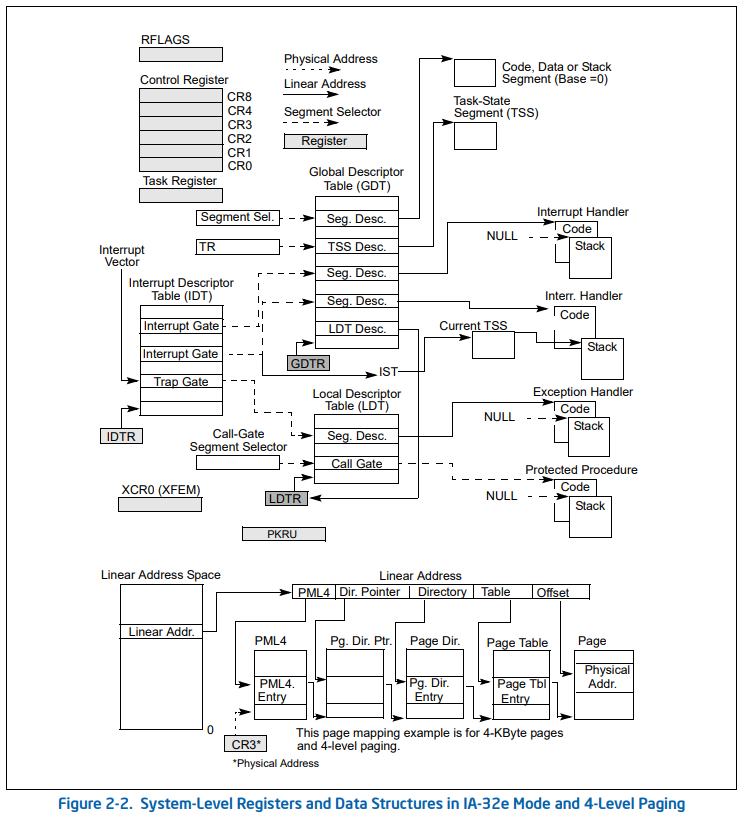

# x86 cpu notes

# The Big Picture

**These are the different parts that are included in the notes.**

**RFLAGS register in 64-bit is the zero extended EFLAGS register**

# CPU Feature Identification

- CPUID instruction is used to check whether features (e.g. 64bit mode, Hardware Virtualization, …) are enabled in the CPU or not.
- CPUID takes its argument in EAX and sometimes ECX.
- The output is stored in EAX, EBX, ECX and EDX.

**Example: Check if features like SGX, SMEP & SMAP are enabled; EAX=7 and ECX=0**

→ Bit 2: SGX, Bit 7: SMEP, Bit 20: SMAP

**Note: A hypervisor can spoof these values.**

# Processor Execution Modes

Intel Processor can execute in several modes. Everything starts in Real Mode.

- If in Real Mode, an SMI# (System Management Interrupt) put the CPU in System Management Mode which an isolated mode that even the most privilege ring can’t tamper with.
- Modern OS’s operate in Protected Mode.
- Long Mode ↔ IA-32e Mode ↔ Intel64 ↔ x86-64

- For practical purposes, we’d need to focus on Real Mode, Protected Mode and IA-32e Mode since those are the modes an OS goes through.

AMD provides a clearer finite state machine of the cpu modes.

# Model Specific Registers (MSRs)

- MSRs allow to enable/configure CPU features (detected by CPUID for example).

- RDMSR is a privileged instruction

- WRMSR is a privileged instruction

**Example: Moving to Long Mode (setting the LME bit in the EFFER register)**

Bit 8: LME, Bit 10: LMA (to check if we’re in Long Mode)

There’s a condition in the comment column about Bit 20 and 29 in the value returned by CPUID in the EDX register.

**Note: Windbg has a rdmsr and wrmsr instruction**

# Privilege Rings and Segmentation

This is how intel envisions the privilege rings. But in reality the kernel runs as if there’s no level 1 or 2.

From the manual:

“Segmentation provides a mechanism of isolating individual code, data, and stack modules so that multiple programs (or tasks) can run on the same processor without interfering with one another.”

“segmentation provides a mechanism for dividing the processor’s addressable memory
space (called the **linear address space**) into smaller protected address spaces called **segments**.”

The full diagram but it is rather complicated.

A less complicated version is this

This is closer (in 64bit space there’ll be more than 4Gb in the memory size):

- “There is no mode bit to disable segmentation”
- “To locate a byte in a particular segment, a logical address (also called a far pointer) must be provided. A logical address consists of a segment selector and an
offset.”
- “The physical address space is defined as the range of addresses that the processor can generate on its address bus”

- Far Pointer = Near Pointer + Segment Selector.

**A logical address is translated into a linear address that gets translated into a virtual address which is then translated into a physical address.**

→ In real mode there’s no paging so there’s no virtual address translation.

- A logical address is translated to a linear address via table lookup.

- The full translation steps from a linear address to a physical address (Paging notes will come later)

- **Intel more or less disabled segmentation except for some few things: CS, ES, SS & DS are considered = 0.**

**Reality in 64-bit mode:**

**→ CS, ES, SS, DS point to a flat space.**

→ **FS & GS are used by OSs to point at different segments.**

- **Segment Selector** is a 16-bit data structure that selects a data structure from two tables.

- Segment Registers can be read/written with MOV.

- Reading and Writing can also be done with PUSH & POP

**Note: there’s no POP CS**

- **Segment Registers** contain a hidden part which acts as a cache for the info of the lookup table so that it doesn’t get fetched from RAM everytime.

Since in 64bit mode **CS, ES, SS & DS** are considered = 0, the hidden part is harcoded.

**FS & GS will contain table info in the hidden part + access controle.**

**CS, ES, SS & DS will contain just access control in the hidden part.**

- GDTR and LDTR are used to find the GDT & LDT tables.
- LDTR behaves like a segment selector i.e. Only the Segment Selector Part is visible.
- Entries in GDT are Segment Descriptor Sturctures

- GDTR = 10 bytes = Linear Address (8 bytes) + Table limit i.e. size (2 bytes)
- Reading is done with LGDT, Writing is done with SGDT

**Note: in Windbg: gdtr = the Linear address, gdtl = Table size.**

- LDTR = 16bit Segment Selector + Linear Address (8 bytes) + Table limit i.e. size (2 bytes)
- Reading is done with LLDT, Writing is done with SLDT

- Each entry in GDT and LDT is called a data structure called Segment Descriptor

“Each segment has a segment descriptor, which specifies the size of the segment, the access rights and privilege level for the segment, the segment type, and the location of the first byte of the segment in the linear address space (called the base address of the segment). The offset part of the logical address is added to the base address for the segment to locate a byte within the segment. The base address plus the offset thus forms a linear address in the processor’s linear address space.

→ L flag (Bit 21): specifies if this is a 64bit segment or not. (go back to AMD state machine CS.L=0 or 1)

- The base address (32bit) in Figure 3-8 is used in compatibiliy mode. In 64bit CS, ES, SS & ES ard are set to 0.
- In the case of  FS and GS, the hidden part of the segment registers is mapped into the IA32_FS_BASE (0xC0000100) and IA32_GS_BASE (0xC0000101) MSRs. Modifying the FS and GS bases is done from the MSRs.

→ Limit (20 bits): size of the segment in bytes of 4kb blocks, for compatibility mode.

- In 64bit mode, limits are not checked even for FS and GS.

→ G Flag: i.e. Granularity flag which specifies if the limit is expressed in bytes or 4kb blocks for compatibility mode.

- Not used in 64 bit mode.

→ P Flag: Present or not (1 or 0).

- “If this flag is clear, the processor generates a segment-not-present exception (#NP) when a segment selector that points to the segment descriptor is loaded into a segment register.”

→ S Flag: 0 for System segment and 1 for Code or Data segment.

→ Type flag (4 bits): Different Types for System and non-system (i.e. Data & Code) segments. 

- **Types of non-system segments:**

- Expand-Down is for Stack Segments to allow them to grow towards lower addresses.
    - Read-Only and Expand-Down can’t be used for stack segments
    - “Loading the SS register with a segment selector for a nonwritable data segment generates a general-protection exception (#GP).”
- Conforming segments allow lower privilege code to execute them.
    - Ring 3 code could jump to Ring 0 conforming segments and keep running.
- Non-conforming segments throw a general protection fault if someone from a lower privilege tries to execute them.
    - These two types are for how intel imagined rings but that’s now how they’re practically used.

- **Types of System segments: “Note that system descriptors in IA-32e mode are 16 bytes instead of 8 bytes.”**

**Note: Windows, in its KGDTENRY64 struct combines S and Type flags into a 5-bit fields of 32 values.**

→ D/B Flag: Its usage depends on the descriptor type.

- In the case of Code Segment:
    - “D” (default opcode size) flag. Specifies whether an overloaded opcode is interpreted as dealing with 16-bit or 32-bit register/memory sizes. Take for example opcode 25, if D==0 then it’s followed by imm16 (2 bytes). If D==1, it’s followed by imm32 (4 bytes).
    - “The instruction prefix 66H can be used to select an operand size other than the default”

- In the case of Stack Stegment:
    - “B” (Big) Flag: specifies whether implicit stack pointer usage (pop, push, call) moves Stack Pointer by 16 bits (B == 0) or by 32 bites (B == 1).
- In the of Expand-Down Data Segment:
    - B Flag: if it’s 0 then upper bound is 0xFFFF. If it’s 1 then it’s 0xFFFFFFFF
    - Expand-Down data segment are used very rarely in practice.

→ DPL Flag: Privilege ring of the segment for Access Control.

- If it’s a non-conforming segment descriptor and DPL == 0, then only ring 0 code can execute from this segment.
- If it’s a Data Segment selector && DPL == 0, only ring 0 code can read/write data from/to this segment.

→ AVL Flag: No specific use. Left for OS to use it or not how they see fit.

**Note: Only the fields in the next figure are used in 64bit mode (documentation says G flag is not used since Limit is not used)**

For the System types in 64-bit mode, Segment Descriptors are expanded to 16 bytes to now they can how 64-bit addresses.

**Current Privilege Level:**

- “The CPL is defined as the protection level of the currently executing code segment.”
- "Current privilege level (CPL) field - (Bits 0 and 1 of the CS segment register.)"

→ Privilege rings are enforced by the hardware in code and data fetches.

- Like in the case of control flow transition to another segment (e.g. jmp/jcc/call/ret), the hardware will check if CPL ≤ DPL to allow access.
- Privileged instructions require CPL == 0 to execute (e.g. LLDT, LGDT…).

→ You cannot write the bits of CS.

- “The MOV instruction cannot be used to load the CS register. Attempting to do so results in an invalid opcode exception (#UD).”
- There’s no POP CS instructions like for DS, FS, SS, ES, GS.

**Call Gates:**

- A Call Gate is one way to transition to another segment at different privilege level.

→ To transition from CPL 3 to CPL 0, use a CALL instruction with a far pointer that had a Segment Selector, that pointed at a Call Gate Segment Descriptor.

**Returning from a Call through a Call Gate:**

- An inter-privilege **far CALL** through a Call Gate pushes SS:RSP and CS:RIP.
- **far RET** can pop those values from the stack to return back from the inter-privilege **far CALL**

**far CALL instruction: privilege changes only if Segment Selector points to a Call Gate.**

**JUMP also supports a far pointer but doesn’t change privilege level.**

# Interrupts

- “Interrupts and exceptions are events that indicatethat a condition exists somewhere in the system, the processor, or within the currently executing program or task that requires the attention of a processor.”
- “ When an interrupt is received or an exception is detected, the currently running procedure or
task is suspended while the processor executes an interrupt or exception handler. When execution of the handler is complete, the processor resumes execution of the interrupted procedure or task.”
- “The processor receives interrupts from two sources:
    - External (hardware generated) interrupts.
    - Software-generated interrupts.”

**Difference between Interrups and Exceptions**

- Exceptions typically indicate an error condition. Interrupts typically indicate an event from an external hardware.
- Interrupts clear the Interrupt Flag. Exceptions don’t.

**Three categories of exceptions**

- Fault: Recoverable, pushed RIP points to the faulting instructions.
- Trap: Recoverable, pushed RIP points to the instruction following the trapping instruction.
- Abort: Unrecoverable, may not be able to save RIP where abort occured.

**Saving state in 64-bit mode, IRET pops it back and resumes execution.**

**Software Generated Interrupts**

- Interrups “n” is invoked via INTn
    - Some interrups except an error code. INT doesn’t push an error code and so the stack can be off which makes the handler not work correctly.
- IRET returns from an interrups, popping the saved state back.

**Some frequent interrupts**

- INT3: “0xCC” Software Breakpoint
- INT1: “0xF1” fake a Hardware Debug Breakpoint
- INTO: invokes overflow interrupt if the overflow flag (OF) in RFLAGS is set to 1.
- UD2: invokes an invalid opcode interrupt.

→ **Interrupts are another way to transfer control from one segment to another at a different privilege level.**

- Task Register (TR) is similar in form to LDTR. It can be manipulated with STR/LTR.

“Task gates are not supported in IA32e mode. On privilege level changes, stack segment selectors are not read from the TSS. Instead, they are set to NULL.”

TSS Descriptor is identical to LDT Descriptor.

The format of TSS is the following

- The 64-bit value at the bottom RSP0 is used as the stack address in which the state is pushed when an interrupts moves execution to ring 0. **Changing to ring n will use RSPn.**
- IST “Interrupt Stack Table” is a list of Stack Addresses to be chosen from for an interrupt.

- IDTR “IDT Register” points at the base of the IDT.
- When a hardware or an interrupt occurs, the hardware:
    - Finds the appropriate offset in the IDT starting from the IDTR.
    - Pushes the saved state onto the stack (at a location determined by the TSS)
    - Changes CS:RIP to point to the interrupt handler as read from the IDT entry (interrupt descriptor)

**→ IDTR has the same format as GDTR. (set/read with LIDT/SIDT)**

How IDTR is used

- The IDT is an array of ≤ 256 16-byte entries.
- 0 to 31 are reserved for architecture-specific exceptions and interrupts.
- 32 to 255 are used defined.

Examples of exceptions and interrupts.

- The descriptors in the IDT describe one of two types:
    - Interrupt Gate
    - Trap Gate
- “The only difference between an interrupt gate and a trap gate is the way the processor handles the IF flag in the EFLAGS register.”

- Type 1110: Interrupt Gate
- Type 1111: Trap Gate

→ IST field specifies an index to use for the RSP as pulled from the TSS.

**Interrupt Masking**

- Interrupts can be disabled by clearing the IF “Interrupt Enable Flag”.
- IF flag is cleared when you go through an Interrupt Gate but not when you go through a Trap Gate.
- CLI to clear IF and SLI to set it.

→ IF doesn’t mask an explicit invocation of an interrupt through INTn.

→ IF doesn’t mask an unmaskable interrupt.

- There’s a condition that makes SIDT privileged: User-Mode Instruction Prevention (Bit 11 of CR4)

→ Same for SGDT, SLDT.

# System Calls

- System Calls are another way to transfer control from a segment to another segment at another privilege level.
- IA_EFFER msr contains a bit about SYSTCALL but the instruction doesn’t depend on it.

- SYSCALL depends on Bit 11 in CPUID with argument in the next figure.

**What happens when SYSCALL**

→ RSP is not saved automatically. Either Kernel or userspace SYSCALL handler is responsible for that.

**Note: How syscall arguments are passed is up to the OS.**

**What happens when SYSRET**

→ Whichever side saved RSP is responsible for storing it.

**Note: 32-bit system prefer SYSENTER/SYSEXIT because they’re supported by both Intel and AMD**

**Layout of the MSRs specified before**

**The RPL is forced to ring 3 when SYSRET is called.**

→ CS.DPL is set to 3.

**Saving general purpose registers**

- “When using SYSCALL to implement system calls, there is no kernel stack at the OS entry point. Neither is there a straightforward method to obtain a pointer to kernel structures from which the kernel stack pointer could be read. Thus, the kernel cannot save general purpose registers or reference memory.”
- “SWAPGS exchanges the current GS base register value with the IA32_KERNEL_GS_BASE MSR (MSR address C0000102H). The SWAPGS instruction is a privileged instruction intended for use by system software.)
    - userspace GS base is mapped to IA32_GS_BASE.
    - Useful for SYSCALL handlers as well as Interrupts handlers

→ if CPUID.07H.0H:EBX.FSGSBASE[Bit 0] = 1 && CR4.FSGSBASE = 1 , then the processor supports the instruction (non-privileged):

- RDFSBASE
- RDGSBASE
- WRFSBASE
- WRGSBASE

These can be used to read/write FS & GS base addresses without using RDMSR/WRMSR

# Read the Time Stamp Counter (RDTSC)

- Set to 0 when processor reset, incremented on each clock cycle.
- It can also be read from IA32_TIME_STAMP_COUNTER (0x10) MSR.
- Setting bit 2 in Control Register 4 allows only ring 0 to use the instruction.
- VM Extensions have special provisions to help hypervisors lie to VMs about RDTSC contents.

# Paging

- **Logical Address**: Far pointer that specifies a segment selector + offset in that segment
- **Linear Address**: Flat 32/64-bit notional address space, post-segmentation
- **Virtual Address**: Address that takes paging into account
- **Physical Address**: Offset into physical RAM

→ When paging is enabled a linear address is the same as a virtual address.

- Physical memory is divided into fixed size chunks called **pages.**
- Memory Management Unit (MMU) is the part of hardware in a processor that uses the current execution mode, segmentation information and paging information to perform the overall process of translating logical address to physical addresses.
- The Translation Lookaside Buffer (TLB) is a cache of Virtual to Physical mappings the MMU uses.

→ **source**: [https://en.wikipedia.org/wiki/Memory_management_unit](https://en.wikipedia.org/wiki/Memory_management_unit)

- There are 5 Control Registers (CR0-CR4) which are used for paging control as well as enable/disabling other features.

- CR0:
    - Protection enabled (PE, bit 0) : must be set to get into Protected Mode from the default reset state of Real Mode.
    - Write Protect (WP, bit 16) : Stops ring 0 from writing to read-only pages. Used by OSes for Copy-on-Write.
    - Paging Enabled (PG, bit 31) = Must be set to enable paging. Requires PE to be set.
- CR4:
    - Page Size Extensions (PSE, bit 4) = Allows for pages > 4KB
    - Physical Address Extension (PAE, bit 5) = Allows physical addresses > 232
    - Page Global Enable (PGE, bit 7) = A feature to make caching page table information more efficient.
    - 57-bit linear addresses (LA57, bit 12) = A new and even larger memory address space is accessible.
    
    **Note: CR0 & CR4 were highlighted in the AMD finite state machine to go from Real Mode to Protected Mode then to Long Mode.**
    
- CR3:
    - Points at the start of the page tables, which the MMU walks to translate virtual memory to physical.
- CR2:
    - If the virtual to physical lookup can't complete for some reason (e.g. permissions, or just because there's no mapping in the page tables) a "page fault" (INT 14) is signaled.
    - CR2 records the linear address which was attempted to be translated via a page table walk.

→ Control Registers are read/written with MOV but only from register to register; No memory moves.

**The big picture**

- MAXPHYADDR : **maximum number of physical address bits** that a specific CPU supports.

**4KB Paging, 32-bit Mode**

→ Page Tables are page aligned.

**4MB Paging 32-bit Mode**

**64-bit 4-level paging (4KB pages)**

**Note**: instead of hardcoded “40”, the figure should say MAXPHYADDR-12 

**64-bit 3-level paging (2MB pages)**

**64-bit 2-level paging (1 GB pages)**

**CR3 with 4-Level Paging**

→ M is **MAXPHYADDR.**

→ PML4 must be page-aligned.

→ PCD and PWT have to do with caching.

- When context switches, the page table address in CR3 changes.

**PMLE4 with 4-Level Paging**

**Note: Memory permissions are restrictive meaning that if the DX bit set to 1 at some level then all subsequent pages are non executable.**

**PDPTE with 4-Level paging**

→ **PS bit specifies whether PDPTE points at 1-GB page or a page directory.**

**PDE with 4-Level paging**

**PTE with 4-Level paging**

**Canonical Addresses**

- The CPU doesn’t use the full 64-bit physical memory space. It uses 57 bits at max in the latest technology.
- The unused bits can be set to 1 or 0 to create two memory sub-spaces. Windows uses the one with 1’s for Kernel space and one with 0’s for User space.

**→ PS:** The next figure hurts the eye.

source: [https://bottomupcs.com/ch06s02.html](https://bottomupcs.com/ch06s02.html)

**Page Fault**

- When the Present bit is not set, translation stops and a Page Fault (INT14) is triggered then then the page fault handler can determines if it can recover from the fault.
- When a Page Fault occurs, the address that the MMU was attempting to translate to physical address is put into the CR2 register.
- Page Fault is the type of faults to push an error code so the page fault handler is responsible for interpreting the error code.

- Recoverable Page faults:
    - Page is “page out”; swapped to disk.
    - Automatic stack growth
    - Attempts to write to read-only memory if memory is intended for copy-on-write.
- Unrecoverable Page Faults:
    - No valid linear to physical translation.
    - Attempts to write to read-only memory that’s not intended for copy-on-write.
    - User code accessing memory marked as supervisor.
    - SMAP/SMEP/XD permission violations (when used).

→ There’s only 4 read/write hardware breakpoints. Some debuggers use Page Faults to halt execution when a target memory is accessed e.g. Marking pages as non present.

**Translation Lookaside Buffer**

- TLB entries which are not marked as Global are flushed every time CR3 is written.
- Ring 0 can use the INVLPG instruction to invalidate the TLB cache entry for a specified virtual memory address.
- There Data TLBs (DTLB) , Instruction TLBs (ITLB) and Shared TLBs (shared between DTLB and ITLB)

# Debugging

**Software Breakpoints**

- Exception of type Trap
- Overwrite a byte with 0xCC (INT3)

**Hardware Breakpoints**

- Only 4 hardware breakpoints can bet set.
- There are 8 Debug registers:
    - DR0-3: Breakpoint linear address registers
    - DR4-4: Reserved (Unused)
    - DR6: Debug Status register
    - DR7: Debug control register

→ All Debug register accesses require CPL == 0

**Note:** There is a DR0 as well.

**Debug Control Register**

**Debug Status Register**

**When a Hardware Breakpoint is triggered**

- It runs 1st entry in IDT which is a Debug Exception #DB
- When it’s an execute breakpoint or general detect it’s a Fault, otherwise it’s a Trap.

**Resume Flag**

- When the RF is set “The processor then ignores instruction breakpoints for the duration of the next instruction.” “The processor then automatically clears this flag after the instruction returned to has been successfully executed.”
- To set the flag, a debug interrupt handler must manipulate the RFLAGS stored on the stack and then use IRETQ (**POPFQ does not transfer RF from the stack into RFLAGS**) under any circumstances

**Trap Flag**

- When set, the Trap Flag TF causes a Debug Exception after every instruction.
- Useful for “Step Into” and “Step Out” which single steps until it steps on a RET instruction.
- if the debug exception is in response to "single stepping", it sets the **DR6.BS** flag
- The processor clears the TF flag before calling the exception handler, so if the debugger wants to keep single-stepping it needs to set it again before returning.

# Port I/O

- “In addition to transferring data to and from external memory, IA-32 processors can also transfer data to and from input/output ports (I/O ports).”
- “I/O ports are created in system hardware by circuity that decodes the control, data, and address pins on the processor. These I/O ports are then configured to communicate with peripheral devices.”
- “An I/O port can be an input port, an output port, or a bidirectional port.”

- There are 2^16 ports numbered from 0 to 0xFFFF.
- Can combine 2 or 4 consecutive ports to achieve a 16 or 32 bit port
- "32-bit ports should be aligned to addresses that are multiples of four (0, 4, 8, ...)."
- IN/OUT instruction are used to access I/O Ports
- I/O Ports access requires CPL ≤ IOPL (I/O Privilege Level: 2 Bits in RFLAGS)

- Most OSes set IOPL to 0.
- STI/CLI for setting and clearing the Interrupt Flag in RFLAGS also are only allowed if CPL <= IOPL.

→ DX is 16 bits so it allows to access all 2^16 ports but imm8 allows only 2^8.

→ “When accessing a 16- and 32-bit I/O port, the operand size attribute determines the port size.” Because the operand for 16/32bit is overloaded.

→ if you’re in a 16 bit segment it’s 16 bit, if you’re in a 32/64 bit segment it’s 32 bit. But you can override it with an operand size instruction prefix.

→ Same caveats as IN

**Which port corresponds to what**

# References

- Intel Manual
- x86-64 OS Internals by OpenSecurityTraining2